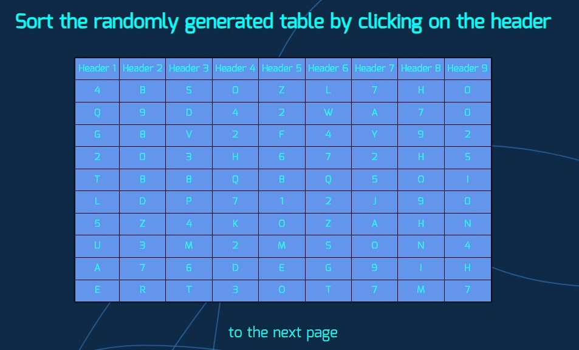

# Events

## Studying events on the example of the following tasks:

1. Create an HTML page to display/edit text. When you open the page, the text is displayed using the div tag. When you press Ctrl + E a textarea with the same text appears instead of the div.

2. Create an HTML page with a large table. When you click on a column header, you need to sort the data in that column. Note that numeric values should be sorted as numbers, not as strings. (As a result, the generation of a random table is implemented).

3. Create an HTML page with a block of text in a frame. Implement the ability to change the size of the block by holding the mouse in the lower right corner and dragging.

